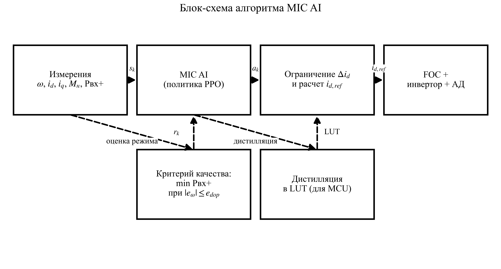
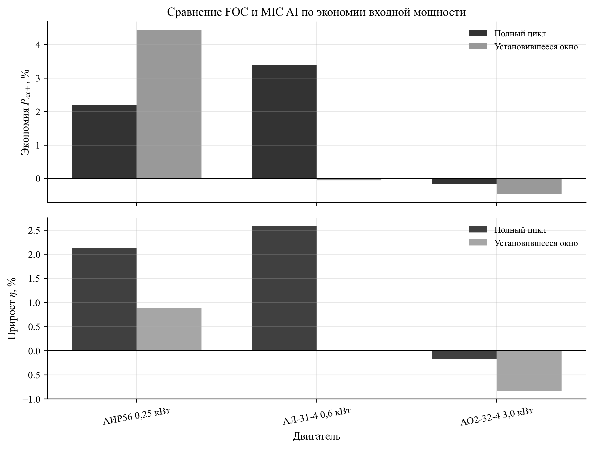
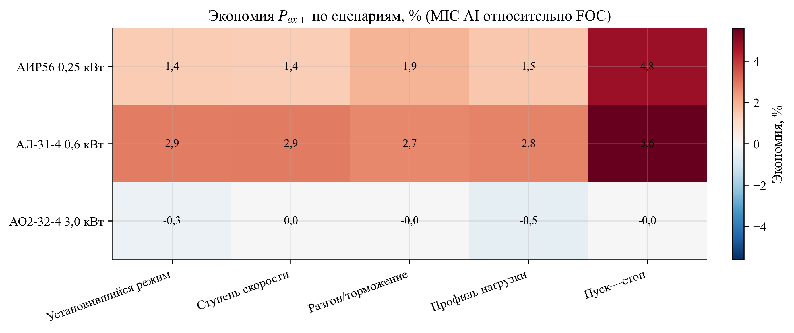
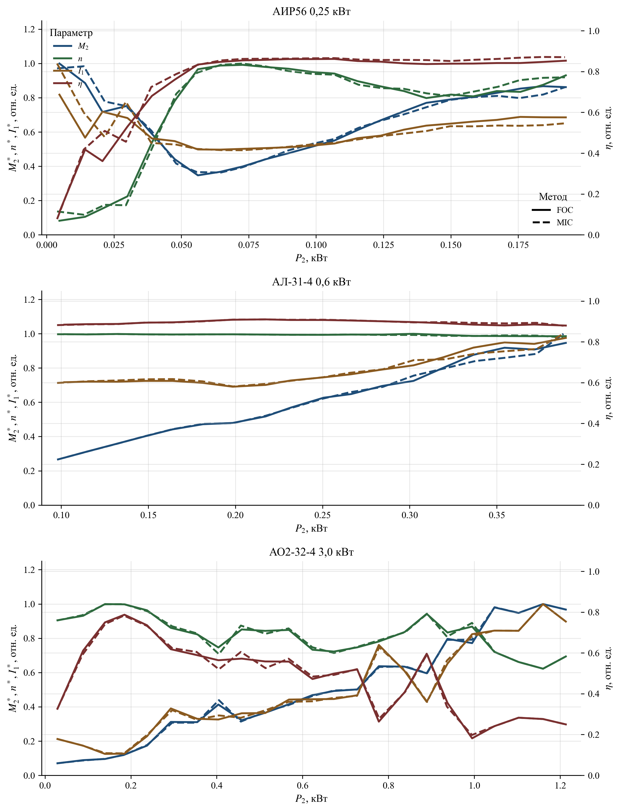
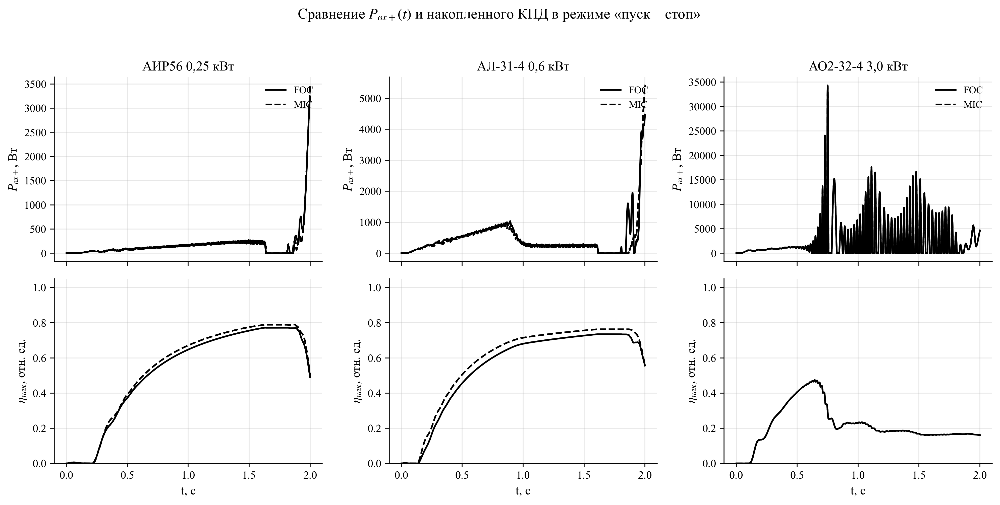
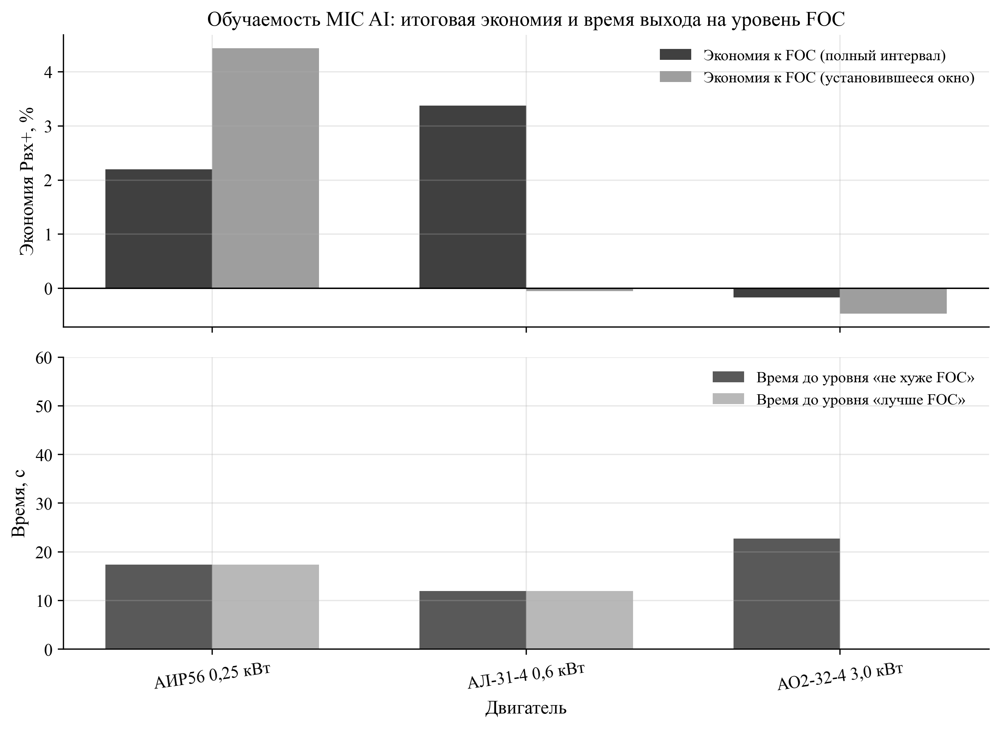

УДК 621.313.333:004.8

# Модельно-независимый самообучающийся алгоритм MIC AI (FOC+PPO) для энергоэффективного управления асинхронными двигателями разных типоразмеров

А. Н. Марикин¹, В. Г. Жемчугов¹, А. Д. Онофрийчук¹

¹ Петербургский государственный университет путей сообщения Императора Александра I, Российская Федерация, 190031, Санкт-Петербург, Московский пр., 9

Для цитирования: Марикин А. Н., Жемчугов В. Г., Онофрийчук А. Д. Модельно-независимый самообучающийся алгоритм MIC AI (FOC+PPO) для энергоэффективного управления асинхронными двигателями разных типоразмеров // Известия Петербургского государственного университета путей сообщения. СПб.: ПГУПС, 2026. – Т. xx, вып. xx. – С. xx–xx. DOI: (присваивается редакцией).

Аннотация.
Цель: разработать и численно проверить в физически параметризованном цифровом двойнике модельно-независимый алгоритм MIC AI, уменьшающий положительную составляющую входной мощности асинхронного электропривода в установившихся и периодических режимах без передачи параметров двигателя в контур принятия решений.
Методы: предложена двухконтурная структура, где внутренний контур полевого ориентирования (FOC) обеспечивает регулирование токов и скорости, а внешний MIC AI-контур на основе обучения с подкреплением (PPO) формирует корректировку задания намагничивающего тока i_d,ref. Обучение выполнено в цифровом двойнике с рандомизацией пяти сценариев («установившийся режим», «ступень скорости», «разгон/торможение», «профиль нагрузки», «пуск—стоп»). Валидация проведена по детерминированному протоколу на трех двигателях (АИР56 0,25 кВт; АЛ-31-4 0,6 кВт; АО2-32-4 3,0 кВт). В метрики включены Pвх+(t)=max(Pвх(t),0), мощность на валу, интегральный КПД η=E2/Eвх и отношение ошибок по скорости ρ_MAE=MAE_MIC/MAE_FOC; дополнительно контролировалась работа нагрузки для исключения «мнимой экономии» за счет уменьшения механической работы.
Результаты: средняя экономия Pвх+ составила 1,80 % на полном интервале и 1,31 % в установившемся окне (последние 30 % временного ряда; для режима «пуск—стоп» — участок плато при ωref≈const); при этом максимальное значение ρ_MAE не превысило 1,023. Неотрицательная экономия Pвх+ получена в 11 из 15 комбинаций «двигатель—сценарий». Наибольший выигрыш достигается в режиме «пуск—стоп», где оптимизация потока проявляется при многократных разгонах и торможениях.
Практическая значимость: MIC AI внедряется как supervisory-надстройка над существующим FOC без вмешательства в силовой тракт и может быть перенесен на микроконтроллер (Arduino/STM32) через дистилляцию политики в таблицу LUT при сохранении протокола ограничений и критериев качества.

Ключевые слова: асинхронный электропривод; векторное управление; FOC; энергоэффективность; оптимизация потока; обучение с подкреплением; PPO; цифровой двойник; модельно-независимое управление.

## 1. Введение
Асинхронный электропривод с частотным преобразователем является базовой технологией транспорта и промышленности. При этом энергетические показатели привода определяются не только конструкцией двигателя, но и выбранной стратегией управления магнитным потоком, т. е. заданием намагничивающего тока $i_d$ в системе полевого ориентирования (FOC) [1–5]. На практике $i_{d,ref}$ часто принимают постоянным или задают по упрощенным правилам, чтобы гарантировать запас по моменту и устойчивость в переходных процессах. Такой подход надежен, но в смешанных рабочих циклах (установившиеся участки, ступени скорости, разгон/торможение, переменная нагрузка, пуски и остановы) он не обеспечивает минимума потерь.

Классическая задача повышения КПД электропривода сводится к поиску компромисса между потерями в меди (рост при больших токах) и потерями в стали (рост при завышенном потоке). Для асинхронного двигателя это означает, что оптимальный поток зависит от режима, нагрузки и ограничения по току/напряжению. В литературе описаны методы оптимизации потока на основе модели потерь и методы экстремального поиска по измеряемым величинам [6, 7]. Их практическое применение усложняется необходимостью идентификации параметров, чувствительностью к шуму и требованием тщательной настройки под конкретный двигатель.

В последние годы развивается направление применения обучения с подкреплением (reinforcement learning, RL) в задачах управления электроприводом [8, 9]. Его ключевое преимущество — возможность формализовать цель «энергия + качество регулирования» как единую оптимизационную постановку и получить управляющее решение при минимуме предположений о параметрах объекта. Однако прямое управление инвертором RL-агентом связано с рисками устойчивости и безопасности.

Цель работы — предложить и исследовать алгоритм MIC AI, который (i) не требует параметров модели двигателя в online-контуре принятия решений, (ii) интегрируется в типовую FOC-систему как внешний supervisory-слой, (iii) обеспечивает воспроизводимое сравнение с классическим FOC в установившихся и периодических режимах.

## 2. Анализ существующих подходов к энергоэффективному управлению
1. **FOC с фиксированным $i_{d,ref}$.** Обеспечивает высокое качество регулирования скорости и момента, но оптимальность по потерям достигается лишь в ограниченном диапазоне режимов, поскольку поток выбран как компромисс [1–5].
2. **Оптимизация потока по модели потерь.** Требует достаточной точности параметров двигателя и модели потерь; чувствительна к насыщению, температуре и старению [6, 7].
3. **Экстремальный поиск (ESC).** Снижает зависимость от модели, но может иметь длительный переход к оптимуму, чувствителен к шуму и требует аккуратной фильтрации измерений.
4. **RL-управление.** Позволяет обучать политику с учетом ограничений, однако в «чистом виде» (без базового стабилизирующего контура) осложняет доказуемую устойчивость и переносимость на MCU [8–11].

В данной работе выбрана гибридная схема: внутренний контур FOC сохраняет структуру и настройки, а MIC AI оптимизирует энергию только через ограниченную коррекцию $i_{d,ref}$.

## 3. Постановка задачи и критерии качества
Рассматривается электропривод с заданием скорости $\omega_{ref}(t)$ и нагрузочным моментом $M_{н}(t)$. Задача MIC AI состоит в снижении потребляемой мощности при сохранении качества регулирования скорости, т. е. при ограничении по ошибке $e_\omega(t)=\omega_{ref}(t)-\omega(t)$.

Для корректного учета потребления в циклах, содержащих торможение и возможную генерацию энергии, вводятся положительные составляющие входной и выходной мощностей:

$$
P_{вх+}(t)=\max(P_{вх}(t),0), \qquad P_{2+}(t)=\max(P_{2}(t),0).
$$

Интегральные энергии на интервале $[0,T]$ и КПД:

$$
E_{вх}=\int_{0}^{T} P_{вх+}(t)\,dt, \qquad
E_{2}=\int_{0}^{T} P_{2+}(t)\,dt, \qquad
\eta=\frac{E_{2}}{E_{вх}}.
$$

Сравнение MIC AI с базовым FOC выполняется по экономии входной мощности и по ухудшению/улучшению качества регулирования:

$$
S_P=100\left(1-\frac{\overline{P}_{вх+}^{MIC}}{\overline{P}_{вх+}^{FOC}}\right), \qquad
\rho_{MAE}=\frac{MAE_{MIC}}{MAE_{FOC}},
$$

где $\overline{P}_{вх+}$ — среднее значение $P_{вх+}(t)$ на рассматриваемом интервале, $MAE$ — средняя абсолютная ошибка скорости.

Примечание по обозначениям: «мощность на валу» $P_2$ в расчетах берется как $P_2=M_{э}\omega$ (по оценке электромагнитного момента). Для исключения «мнимой экономии» дополнительно контролируется выполненная работа нагрузки $E_{load}=\int_0^T \max(M_{н}(t)\omega(t),0)\,dt$; в опубликованном протоколе отношение $E_{load}^{MIC}/E_{load}^{FOC}$ не опускается ниже 0,99.

## 4. Алгоритм MIC AI
### 4.1. Архитектура FOC+MIC AI
Внутренний контур FOC содержит регуляторы тока и скорости и формирует управляющие напряжения инвертора. MIC AI не заменяет FOC и не управляет силовым преобразователем напрямую: он работает как внешний корректор задания потока, формируя $i_{d,ref}$ в ограниченном диапазоне вокруг базового значения $i_{d,base}$.

На рис. 1 показана структура алгоритма и взаимосвязь между контуром управления и контуром обучения/ограничений.

### 4.2. Наблюдения и модельная независимость
Вектор наблюдений MIC AI формируется только из измеряемых или вычисляемых по измерениям величин: $\omega$, $\omega_{ref}$, ошибка скорости $e_\omega$, токи $i_d$, $i_q$, оценка нагрузки, положительная входная мощность Pвх+ (с фильтрацией) и вспомогательные признаки режима (например, производные/предыдущие значения). Параметры модели двигателя ($R_s$, $R_r$, $L_m$, $L_{\sigma}$, $J$, $B$ и др.) во вход политики не подаются, что и определяет модельную независимость online-контура.

Состав признаков, используемых в данной работе, приведен в табл. 1.

Таблица 1 – Состав вектора наблюдений MIC AI и физический смысл признаков

| Компонента наблюдений | Обозначение (в статье) | Физический смысл |
|---|---|---|
| Скорость ротора (нормированная) | $\omega$ | Скорость ротора в относительных единицах. |
| Задание скорости (нормированное) | $\omega_{ref}$ | Нормированное задание скорости. |
| Ошибка скорости (нормированная) | $e_\omega$ | Нормированная абсолютная ошибка $\lvert \omega_{ref}-\omega \rvert$. |
| Ток по оси $d$ (нормированный) | $i_d$ | Компонента тока, формирующая магнитный поток. |
| Ток по оси $q$ (нормированный) | $i_q$ | Компонента тока, формирующая электромагнитный момент. |
| Оценка скольжения | $s$ | Нормированная оценка скольжения/несовпадения синхронной и механической частот. |
| Оценка момента нагрузки | $M_{н}$ | Оценка момента нагрузки (в реальном приводе — по наблюдателю/оценке). |
| Положительная входная мощность (нормированная) | $P_{вх+}$ | Нормированная положительная составляющая входной мощности. |
| Фильтрованная входная мощность | $\widetilde{P}_{вх+}$ | Сглаженная версия $P_{вх+}$ для устойчивости вознаграждения. |
| Положительная механическая мощность (нормированная) | $P_{2+}$ | Нормированная положительная механическая мощность на валу. |
| Оценка КПД | $\eta$ | Оценка эффективности (например, $\eta_{inst}=P_{2+}/P_{вх+}$). |

### 4.3. Действие, «шлюз» и формирование $i_{d,ref}$
В режиме `ai_id_ref` агент PPO формирует одно непрерывное действие $a_k\in[-1;1]$, которое интерпретируется как относительная поправка к базовому заданию потока $i_{d,base}$:

$$
i_{d,ref}^*(k)= i_{d,base} + g_k\,a_k\,\Delta i_{d,\max}\,\max\{1,|i_{d,base}|\},
$$

где $\Delta i_{d,\max}$ — коэффициент масштабирования действия, а $g_k\in[0;1]$ — «шлюз» (gate), который подавляет уменьшение потока при больших ошибках скорости. В реализации $g_k$ вычисляется по ошибке на предыдущем шаге и допуска $e_{gate}$:

$$
g_k=\max\!\left(0,1-\frac{\left|\omega_{ref}(k-1)-\omega(k-1)\right|}{e_{gate}}\right)^{\nu},\qquad
e_{gate}=e_{gate,rel}\,\max\left(|\omega_{ref}(k-1)|,\varepsilon\right),
$$

где $\nu$ — показатель «жесткости» шлюза, $\varepsilon$ — малое число. Далее применяется ограничение по диапазону и фильтрация задания:

$$
i_{d,ref}(k)=\mathrm{sat}_{[i_{d,min},\,i_{d,max}]}\Big(\alpha\, i_{d,ref}^*(k)+(1-\alpha)\,i_{d,ref}(k-1)\Big),
$$

а также защитное правило: при $g_k<0{,}5$ вводится запрет на длительное снижение потока в переходных процессах, $i_{d,ref}(k)\ge i_{d,base}$. Инженерный смысл этого блока следующий: пока привод «догоняет» задание скорости (или работает на границе токоограничений), MIC AI практически не вмешивается; оптимизация потока активируется в квазистационарных участках, где влияние на динамику минимально, а экономия потерь максимальна.

### 4.4. Функция вознаграждения, нормализация и ограничения
Цель обучения формулируется как минимизация энергопотребления при ограничении качества регулирования скорости. Для этого вводится стоимость шага $J_k$ как взвешенная сумма нормированных слагаемых:

$$
J_k = w_{speed}\,e_{\omega,n}(k)
     +\gamma_k\!\left(w_{power}\,p_{вх,n}(k)+w_{current}\,i_{n}(k)+w_{shaft}\,\delta_{shaft}(k)+w_{\eta}\,\delta_{\eta}(k)\right)
     +w_{smooth}\,\Delta i_{d,n}(k)^2
     +w_{mag}\,i_{d,dev,n}(k),
$$

где $e_{\omega,n}=|\omega-\omega_{ref}|/\max(|\omega_{ref}|,\varepsilon)$ — нормированная ошибка скорости, $p_{вх,n}=\widetilde{P}_{вх+}/P_{base}$ — нормированная (и сглаженная) положительная входная мощность, $i_n=I_{rms}/I_{lim}$ — нормированный ток, $\Delta i_{d,n}=(i_{d,ref}(k)-i_{d,ref}(k-1))/I_{lim}$ — нормированный шаг изменения задания потока, $i_{d,dev,n}=|i_{d,ref}-i_{d,base}|/I_{lim}$ — отклонение от базового потока. Нормирующая мощность выбирается как $P_{base}=U_{nom}\,I_{lim}$.

Слагаемые $\delta_{shaft}$ и $\delta_{\eta}$ используются как «предохранители» от деградации полезной мощности и эффективности:

$$
\delta_{shaft}=\frac{\max(0,P_{2,target+}-P_{2+})}{P_{base}},\qquad
\delta_{\eta}=\max\!\left(0,1-\frac{\eta_{inst}}{\eta_{clip}}\right),\qquad
\eta_{inst}=\frac{P_{2+}}{P_{вх+}},
$$

где $P_{2,target+}=\max(0,\omega_{ref}\max(M_{н},0))$ — целевая положительная мощность нагрузки, $P_{2+}=\max(0,M_{э}\omega)$ — положительная механическая мощность (по оценке электромагнитного момента $M_{э}$), а $\eta_{clip}$ — верхняя граница нормирования.

Коэффициент $\gamma_k$ реализует «энергетический шлюз» по допуску скорости: если $|\omega-\omega_{ref}|>e_{tol}$, то $\gamma_k=0$ и энергетические слагаемые выключаются, чтобы MIC AI не ухудшал динамику разгона/торможения. В противном случае $\gamma_k=1$.

Вознаграждение шага задается как

$$
r_k=\mathrm{clip}\!\left(r_{max}-J_k,\;r_{min},\;r_{max}\right).
$$

Безопасность обеспечивается комбинацией: (i) насыщения $i_{d,ref}$ и ограничения $\Delta i_{d,\max}$, (ii) шлюза $g_k$ и правила $i_{d,ref}\ge i_{d,base}$ в переходных режимах, (iii) мягких и жестких ограничений по току (штраф за превышение $I_{soft}$ и аварийное завершение при $I>I_{hard}$), (iv) контроля некорректных состояний модели (NaN/inf).

### 4.5. Обучение PPO и дистилляция в LUT
Для обучения используется PPO [8] как устойчивый к шуму и ограниченным шагам градиентный метод, применимый к непрерывному действию. Обучение проводится в цифровом двойнике; далее политика может быть:
1) применена в виде нейросети на вычислительно мощном контроллере;
2) дистиллирована в таблицу LUT (look-up table) для микроконтроллера при фиксированном формате наблюдений, что показано на рис. 1.

Параметры обучения и используемые веса критерия приведены в табл. 2.

Таблица 2 – Параметры обучения PPO и настройки ограничений MIC AI (единые для всех трех двигателей)

| Параметр | Значение |
|---|---:|
| Число эпизодов обучения | 40 |
| Длина эпизода, шагов | 4000 |
| Шаг моделирования dt, с | 0,001 |
| Длительность сценария T, с | 2,0 |
| Доля установившегося окна | 0,30 |
| Δi_d,max (масштаб действия, отн.) | 0,20 |
| α (сглаживание i_d,ref) | 0,10 |
| e_tol,rel (допуск скорости для γ_k) | 0,03 |
| e_gate,rel (допуск скорости для g_k) | 0,07 |
| ν (показатель шлюза g_k) | 1,5 |
| w_speed | 2,0 |
| w_power | 6,0 |
| w_current | 0,2 |
| w_smooth | 0,02 |
| w_mag | 0,01 |
| w_shaft | 6,0 |
| w_η | 2,0 |
| η_clip | 1,0 |

## 5. Методика исследования
### 5.1. Объекты исследования
В качестве объектов выбраны три асинхронных двигателя различной мощности. Параметры двигателя используются только внутри цифрового двойника; MIC AI не получает их во входных данных.

Таблица 3 – Исследованные двигатели и конфигурации цифрового двойника

| Двигатель | Номинальная мощность, кВт | Конфигурация |
|---|---:|---|
| АИР56 | 0,25 | config/env_research_air56_025kw.py |
| АЛ-31-4 | 0,60 | config/env_research_al31_4_06kw.py |
| АО2-32-4 | 3,00 | config/env_research_ao2_32_4_3kw.py |

### 5.2. Сценарии режимов
Оценка выполнена на пяти сценариях:
1) **Установившийся режим** — постоянные $\omega_{ref}$ и $M_{н}$.
2) **Ступень скорости** — скачкообразное изменение $\omega_{ref}$.
3) **Разгон/торможение** — линейное изменение $\omega_{ref}$.
4) **Профиль нагрузки** — изменение $M_{н}$ при фиксированной $\omega_{ref}$.
5) **Пуск—стоп** — циклические пуски и остановы.

Для всех сценариев используется одинаковая длительность моделирования $T=2$ с и шаг интегрирования $dt=1$ мс; это исключает смещение метрик из-за различий горизонта сравнения.

### 5.3. Протокол сравнения MIC AI и FOC
1. Для каждого двигателя обучается политика PPO в цифровом двойнике при рандомизации сценариев.
2. Среди сохраненных чекпойнтов выбирается политика, обеспечивающая максимальную среднюю экономию Pвх+ при выполнении ограничений по качеству регулирования скорости ($\max\rho_{MAE}\le 1{,}05$) и при сохранении сопоставимой механической работы нагрузки (см. ниже). Для выбранного чекпойнта выполняется детерминированная оценка MIC AI и базового FOC на одном и том же наборе сценариев.
3. Метрики вычисляются для полного интервала $[0,T]$ и для «установившегося окна» (последние 30 % временного ряда; для сценария «пуск—стоп» — последние 30 % участка плато при $\omega_{ref}\approx\mathrm{const}$), что позволяет разделить влияние переходных процессов и стационарной оптимизации потока.
4. Качество регулирования контролируется по отношению ошибок $\rho_{MAE}$ и по соблюдению ограничений скорости (gate/ограничения не допускают деградации регулирования).

Дополнительная проверка достоверности выигрыша: чтобы исключить «ложную экономию» за счет уменьшения выполненной механической работы, отдельно вычислялась работа нагрузки

$$
E_{н}=\int_{0}^{T} M_{н}(t)\,\omega(t)\,dt,
$$

где $M_{н}(t)$ задается сценарием. Во всех 15 комбинациях «двигатель—сценарий» отношение $E_{н}^{MIC}/E_{н}^{FOC}$ находилось в диапазоне $[0{,}999;\,1{,}016]$ для полного интервала и $[0{,}992;\,1{,}007]$ для установившегося окна, то есть MIC AI сохранял сопоставимый объем выполненной работы при снижении $P_{вх+}$.

Чтобы исключить возможный артефакт, связанный с отсечением отрицательных значений в определении $P_{вх+}(t)$, дополнительно контролировалась экономия по знаковой (неотсеченной) средней мощности $\overline{P_{вх}}$. Для всех комбинаций «двигатель—сценарий» знак выигрыша совпадал с оценкой по $P_{вх+}$ (валидационный отчет формируется автоматически в `paper/pgups_2026/data/validation_report_pgups_2026.csv`).

## 6. Результаты и обсуждение
### 6.1. Сводные результаты по двигателям
На рис. 2 приведено сравнение MIC AI и FOC по экономии Pвх+ и изменению интегрального КПД. Численные значения сведены в табл. 4.

Таблица 4 – Сводные результаты MIC AI относительно FOC (усреднение по пяти сценариям)

| Двигатель | Экономия Pвх+, % (полный интервал) | Экономия Pвх+, % (установившееся окно) | Изменение η, % (полный интервал) | Изменение η, % (установившееся окно) | max ρ_MAE |
|---|---:|---:|---:|---:|---:|
| АИР56 0,25 кВт | 2,20 | 4,44 | 2,14 | 0,89 | 0,988 |
| АЛ-31-4 0,6 кВт | 3,38 | −0,05 | 2,58 | 0,00 | 0,976 |
| АО2-32-4 3,0 кВт | −0,17 | −0,47 | −0,17 | −0,83 | 1,023 |

В среднем по трем двигателям экономия Pвх+ составила 1,80 % на полном интервале и 1,31 % в установившемся окне; при этом $\max\rho_{MAE}=1{,}023$.

### 6.2. Сценарная картина выигрыша
Сценарные результаты по экономии Pвх+ показаны на рис. 3. Эффект распределен неравномерно: наибольший средний выигрыш достигается в режиме «пуск—стоп», а также в сценариях со сменой скорости (ступень, разгон/торможение). В ряде комбинаций для двигателя АО2-32-4 экономия по Pвх+ близка к нулю или отрицательна (до −0,49 % на полном интервале и до −2,25 % в установившемся окне в сценарии «профиль нагрузки»), что указывает на ограниченный потенциал оптимизации потока при заданных ограничениях по качеству.

Для интерпретации важно отметить, что MIC AI оптимизирует только i_d,ref и поэтому влияет на баланс потерь опосредованно, через выбор потока при ограничениях по току/моменту. В части режимов базовый FOC уже близок к компромиссному значению потока, что ограничивает потенциальный выигрыш. Тем не менее, в 11 из 15 комбинаций «двигатель—сценарий» получена неотрицательная экономия Pвх+ на полном интервале; для всех комбинаций дополнительно подтверждено сохранение сопоставимой работы нагрузки (см. разд. 5.3).

Наибольшая «локальная» экономия на полном интервале получена для двигателя АЛ-31-4 в режиме «пуск—стоп»: средняя мощность Pвх+ снизилась с 456 до 430 Вт (экономия 5,60 %), при этом ρ_MAE=0,951. Максимальная экономия в установившемся окне наблюдается у двигателя АИР56 в режиме «пуск—стоп»: Pвх+ снизилась с 230 до 214 Вт (экономия 6,92 %) при ρ_MAE=0,988. В относительных процентах эффект выглядит заметнее для частичных нагрузок, где потери на намагничивание и в силовой электронике сравнимы с полезной мощностью и чувствительны к выбору i_d,ref.

Для объяснения разброса выигрыша по двигателям выполнена дополнительная проверка «потенциала оптимизации потока» (flux headroom): для каждого двигателя в двух режимах («установившийся режим» и «ступень скорости») проведен перебор $i_{d,ref}$ в базовом FOC, а затем выбран минимум $\overline{P}_{вх+}$ в установившемся окне при ограничении по ошибке скорости $MAE\le 1{,}05\cdot MAE_{FOC}$ (тот же допуск, что и в протоколе сравнения). Полученная величина трактуется как верхняя оценка выигрыша, достижимого одной лишь оптимизацией потока без изменения структуры внутреннего контура. Результаты приведены в табл. 5. Видно, что для двигателя АЛ-31-4 базовое значение $i_{d,base}$ уже близко к оптимальному, поэтому потенциальная экономия практически отсутствует (не более 0,52 %). Для двигателя АО2-32-4 в установившемся режиме потенциал равен 0 %, тогда как при ступени скорости возможен выигрыш порядка 4,20 %. Для двигателя АИР56 наблюдается наибольший запас (до 9,42 % при ступени скорости), что согласуется с заметной экономией на рис. 3.

Таблица 5 – Потенциал экономии $P_{вх+}$ при оптимальном выборе $i_{d,ref}$ в FOC (установившееся окно, ограничение по $MAE$ скорости)

| Двигатель | Режим | $i_{d,base}$, А | $P_{вх+}$, баз., Вт | $i_{d,opt}$, А | $P_{вх+}$, opt, Вт | Потенциал экономии, % |
|---|---|---:|---:|---:|---:|---:|
| АИР56 0,25 кВт | Ступень скорости | 1,35 | 94,1 | 2,00 | 85,2 | 9,42 |
| АИР56 0,25 кВт | Установившийся режим | 1,35 | 87,6 | 1,73 | 85,1 | 2,93 |
| АЛ-31-4 0,6 кВт | Ступень скорости | 1,50 | 185,2 | 0,65 | 184,3 | 0,52 |
| АЛ-31-4 0,6 кВт | Установившийся режим | 1,50 | 186,0 | 0,83 | 185,9 | 0,02 |
| АО2-32-4 3,0 кВт | Ступень скорости | 1,80 | 193,1 | 1,91 | 185,0 | 4,20 |
| АО2-32-4 3,0 кВт | Установившийся режим | 1,80 | 192,6 | 1,80 | 192,6 | 0,00 |

### 6.3. Сравнение механических характеристик
Сопоставление механических характеристик (нормированные зависимости момента $M_2$, скорости $n$, тока $I_1$ и КПД) приведено на рис. 4. Для всех трех двигателей MIC AI сохраняет форму характеристик, близкую к базовому FOC, что подтверждает корректность «надстроечного» принципа: внутренняя структура FOC не нарушается, а внешняя оптимизация потока не приводит к деградации управления.

### 6.4. Временные диаграммы потребления и накопленного КПД
На рис. 5 показаны временные диаграммы Pвх+(t) и накопленного КПД $\eta_{cum}(t)=E_2(t)/E_{вх}(t)$ в режиме «пуск—стоп». Данный режим является чувствительным к настройке потока, поскольку включает многократные разгоны и торможения, а также участки малой скорости, где относительная доля потерь возрастает.

### 6.5. Обучаемость: время выхода на уровень FOC
В табл. 6 приведено время обучения до достижения уровней «не хуже FOC» и «лучше FOC» по критериям:

$$
\text{«не хуже FOC»}:\quad \max\rho_{MAE}\le 1{,}05;
\qquad
\text{«лучше FOC»}:\quad \max\rho_{MAE}\le 1{,}05\ \land\ \overline{S_P}>0.
$$

Таблица 6 – Время достижения уровней качества (по данным обучения; «стендовое» время — вычислительное время на модельном стенде)

| Двигатель | Эпизод «не хуже FOC» | Время, с | Эпизод «лучше FOC» | Время, с |
|---|---:|---:|---:|---:|
| АИР56 0,25 кВт | 0 | 17,4 | 0 | 17,4 |
| АЛ-31-4 0,6 кВт | 0 | 12,0 | 0 | 12,0 |
| АО2-32-4 3,0 кВт | 1 | 22,7 | — | — |

Примечание: для двигателя АО2-32-4 критерий «лучше FOC» в пределах 40 эпизодов обучения не достигнут.

Графическое представление итоговой экономии и времени выхода на уровень FOC приведено на рис. 6.

## 7. Заключение
Предложен и исследован модельно-независимый алгоритм MIC AI, реализующий самообучающуюся оптимизацию потока как внешний supervisory-слой над классическим FOC. На трех асинхронных двигателях разных типоразмеров показано, что корректировка $i_{d,ref}$, выученная в цифровом двойнике, позволяет снизить положительную составляющую входной мощности Pвх+ при сохранении качества регулирования скорости. Средняя экономия составила 1,80 % на полном интервале и 1,31 % в установившемся окне при $\max\rho_{MAE}=1{,}023$; неотрицательная экономия на полном интервале получена в 11 из 15 комбинаций «двигатель—сценарий». Наибольший эффект проявляется в режимах с выраженной нестационарностью (в частности, «пуск—стоп»), где фиксированное задание потока является наименее оптимальным.

Дальнейшая работа направлена на расширение набора режимов, строгую формализацию ограничений (constrained RL) и перенос MIC AI на микроконтроллеры с подтверждением результатов на стенде.

## Список источников
1. Blaschke F. The principle of field orientation as applied to the new transvector closed-loop control system for rotating-field machines // Siemens Review. 1972. Vol. 39. No. 5. P. 217–220.
2. Leonhard W. Control of Electrical Drives. 3rd ed. Berlin: Springer, 2001. 460 p.
3. Vas P. Sensorless Vector and Direct Torque Control. Oxford: Oxford University Press, 1998. 729 p.
4. Krause P. C., Wasynczuk O., Sudhoff S. D., Pekarek S. Analysis of Electric Machinery and Drive Systems. 3rd ed. Hoboken: Wiley-IEEE Press, 2013. 680 p.
5. Boldea I., Nasar S. A. Electric Drives. 3rd ed. Boca Raton: CRC Press, 2010. 544 p.
6. Ключев В. И. Теория электропривода. 2-е изд. М.: Энергоатомиздат, 2001. 704 с.
7. Сандлер А. С., Сарбатов Р. С. Автоматическое управление электроприводами. М.: Энергия, 1974. 560 с.
8. Schulman J., Wolski F., Dhariwal P., Radford A., Klimov O. Proximal Policy Optimization Algorithms // arXiv:1707.06347. 2017.
9. Sutton R. S., Barto A. G. Reinforcement Learning: An Introduction. 2nd ed. Cambridge, MA: MIT Press, 2018. 552 p.
10. Raffin A., Hill A., Gleave A., Kanervisto A., Ernestus M., Dormann N. Stable-Baselines3: Reliable Reinforcement Learning Implementations // Journal of Machine Learning Research. 2021. Vol. 22. P. 1–8.
11. Brockman G., Cheung V., Pettersson L., Schneider J., Schulman J., Tang J., Zaremba W. OpenAI Gym // arXiv:1606.01540. 2016.
12. ГОСТ Р 7.0.100-2018. Библиографическая запись. Библиографическое описание. Общие требования и правила составления. М.: Стандартинформ, 2018.
13. Известия Петербургского государственного университета путей сообщения. Требования к оформлению научных статей (раздел для авторов). URL: https://izvestiapgups.org/authors.html (дата обращения: 13.02.2026).
14. Известия Петербургского государственного университета путей сообщения. Шаблон оформления статьи `Oformlenie_stati_2026.docx`. URL: https://izvestiapgups.org/assets/files/Oformlenie_stati_2026.docx (дата обращения: 13.02.2026).
15. IEEE Editorial Style Manual. URL: https://journals.ieeeauthorcenter.ieee.org/your-role-in-article-production/ieee-editorial-style-manual/ (дата обращения: 13.02.2026).

Дата поступления: (заполняется редакцией).
Решение о публикации: (заполняется редакцией).

Контактная информация
МАРИКИН Андрей Николаевич — д-р техн. наук, профессор, marikin.an@pgups.ru
ЖЕМЧУГОВ Владимир Геннадьевич — канд. техн. наук, доцент, zhemchugov.vg@pgups.ru
ОНОФРИЙЧУК Андрей Дмитриевич — аспирант, onofriychuk.ad@pgups.ru

# Model-Free Self-Learning MIC AI (FOC+PPO) Algorithm for Energy-Efficient Control of Induction Motors Across Multiple Frame Sizes

A. N. Marikin¹, V. G. Zhemchugov¹, A. D. Onofriychuk¹

¹ Emperor Alexander I Petersburg State Transport University, 9 Moskovsky pr., Saint Petersburg, 190031, Russian Federation

For citation: Marikin A. N., Zhemchugov V. G., Onofriychuk A. D. Model-Free Self-Learning MIC AI (FOC+PPO) Algorithm for Energy-Efficient Control of Induction Motors Across Multiple Frame Sizes. Proceedings of Petersburg Transport University. Saint Petersburg: PGUPS, 2026. Vol. xx, Iss. xx. pp. xx–xx. DOI: (assigned by publisher). (In Russian)

Summary
Objective: to develop and validate a model-free MIC AI supervisory layer that reduces induction-drive input power without using motor parameters in the decision loop.
Methods: an inner field-oriented control loop (FOC) ensures stable speed/current regulation, while MIC AI (PPO) adjusts the magnetizing-current reference $i_{d,ref}$ under explicit constraints and a speed-error gate. Training is performed in a digital twin with randomized operation scenarios.
Results: across three motors (0.25, 0.6 and 3.0 kW), mean input-power saving is 1.80% over the full interval and 1.31% in the steady window, with maximum speed-error MAE ratio $\rho_{MAE}$ not exceeding 1.023. Nonnegative saving is achieved in 11 out of 15 motor–scenario combinations.
Practical importance: MIC AI can be deployed as an add-on over existing industrial FOC loops and distilled into an LUT representation for MCU implementation.

Keywords: induction motor; field-oriented control; energy efficiency; flux optimization; reinforcement learning; PPO; digital twin; model-free control.

## References
1. Blaschke F. The principle of field orientation as applied to the new transvector closed-loop control system for rotating-field machines // Siemens Review. 1972. Vol. 39. No. 5. P. 217–220.
2. Leonhard W. Control of Electrical Drives. 3rd ed. Berlin: Springer, 2001. 460 p.
3. Vas P. Sensorless Vector and Direct Torque Control. Oxford: Oxford University Press, 1998. 729 p.
4. Krause P. C., Wasynczuk O., Sudhoff S. D., Pekarek S. Analysis of Electric Machinery and Drive Systems. 3rd ed. Hoboken: Wiley-IEEE Press, 2013. 680 p.
5. Boldea I., Nasar S. A. Electric Drives. 3rd ed. Boca Raton: CRC Press, 2010. 544 p.
6. Klyuchev V. I. Teoriya elektroprivoda [Theory of Electric Drive]. 2nd ed. Moscow: Energoatomizdat, 2001. 704 p. (In Russian).
7. Sandler A. S., Sarbatov R. S. Avtomaticheskoe upravlenie elektroprivodami [Automatic Control of Electric Drives]. Moscow: Energiya, 1974. 560 p. (In Russian).
8. Schulman J., Wolski F., Dhariwal P., Radford A., Klimov O. Proximal Policy Optimization Algorithms // arXiv:1707.06347. 2017.
9. Sutton R. S., Barto A. G. Reinforcement Learning: An Introduction. 2nd ed. Cambridge, MA: MIT Press, 2018. 552 p.
10. Raffin A., Hill A., Gleave A., Kanervisto A., Ernestus M., Dormann N. Stable-Baselines3: Reliable Reinforcement Learning Implementations // Journal of Machine Learning Research. 2021. Vol. 22. P. 1–8.
11. Brockman G., Cheung V., Pettersson L., Schneider J., Schulman J., Tang J., Zaremba W. OpenAI Gym // arXiv:1606.01540. 2016.
12. GOST R 7.0.100-2018. Bibliographic record. Bibliographic description. General requirements and rules of compilation. Moscow: Standartinform, 2018. (In Russian).
13. Proceedings of Petersburg Transport University (Izvestiya PGUPS). Requirements for manuscript preparation (for authors). URL: https://izvestiapgups.org/authors.html (accessed: 13.02.2026). (In Russian).
14. Proceedings of Petersburg Transport University (Izvestiya PGUPS). Article template `Oformlenie_stati_2026.docx`. URL: https://izvestiapgups.org/assets/files/Oformlenie_stati_2026.docx (accessed: 13.02.2026). (In Russian).
15. IEEE Editorial Style Manual. URL: https://journals.ieeeauthorcenter.ieee.org/your-role-in-article-production/ieee-editorial-style-manual/ (accessed: 13.02.2026).

Received: (filled by publisher).
Accepted: (filled by publisher).

Author’s information
Andrey N. Marikin — Doctor of Engineering Sciences, Professor, marikin.an@pgups.ru
Vladimir G. Zhemchugov — PhD in Engineering, Associate Professor, zhemchugov.vg@pgups.ru
Andrey D. Onofriychuk — Postgraduate student, onofriychuk.ad@pgups.ru
